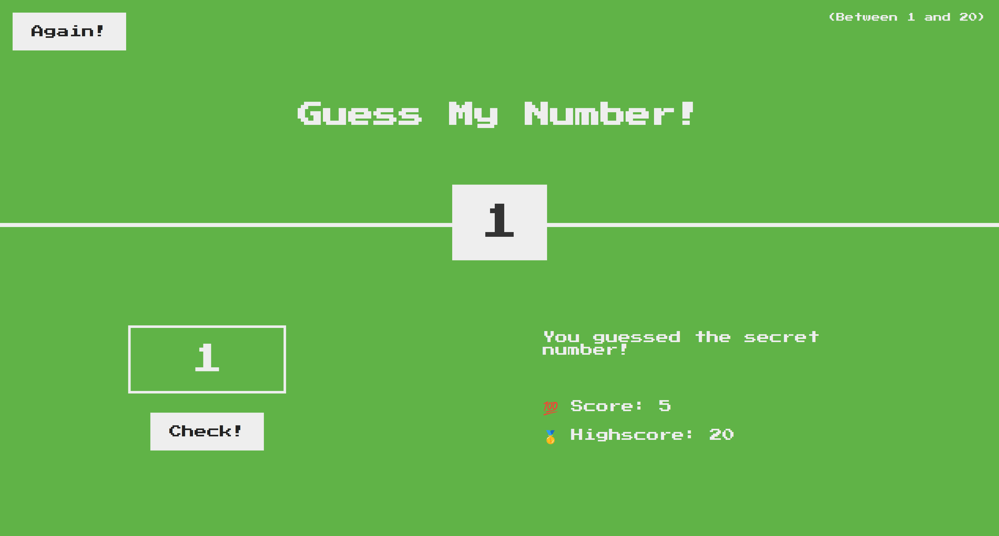

# Guess My Number

A simple game that challenges the user to guess a number between 1 and 20. Written in HTML, CSS, and Vanilla JavaScript.

## Demo

You can check the demo [here](https://guessmynumber-09.netlify.app/).

## How it works

- A random number is generated between 1 and 20.
- The user is asked to guess a number and enter it in the text box.
- The user is told if their guess is too high or too low if the guessed number is incorrect.
- Otherwise, the user is congratulated, and the game is over.

## Features

- Responsive design.
- Ability to reset and play again.
- User high score is saved in memory.

## Improvements

- Save high score to local storage.

## Notes

This project is part of JavaScript Course by Jonas Schmedtmann on [Udemy](https://www.udemy.com/course/the-complete-javascript-course/).
